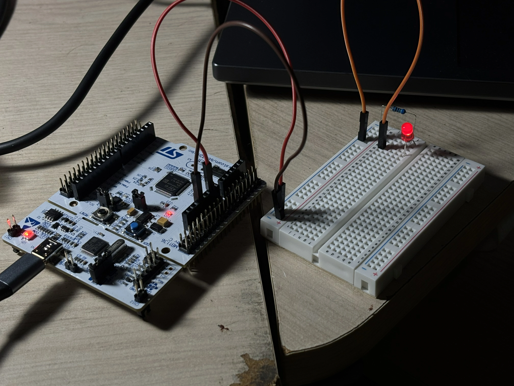
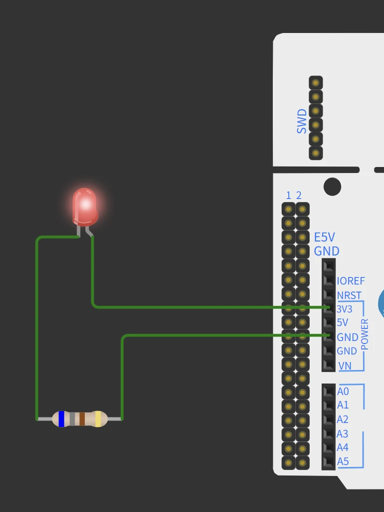

# stm32 study note -- stm32学习笔记

<p>记录一下学习stm32的笔记以及小project<br>
take notes about stm32 learning</p>

<p>在学习阶段我使用了Nucleo f103RB开发板，开发工具使用了STM32CubeIDE，STM32Monitor和STM32CubeMX软件<br>
board and applications</p>

## 1. build a LED circuit -- 点亮LED电路 --2026.07.24

<p>这是第一个project，还没有用到代码，只是熟悉一下如何接线<br>
first project is to familiar with the hardware and connecting wires</p>
<p>设计电路时需要注意电阻的选择，注意led的额定电压和电流，然后假设一个流过led的电流，计算出将要选择的电阻的阻值。</p>

<div>


</div>

## 2. make the LED flashing -- 闪烁led灯 -- 2026.07.26

<p>这个project将使用代码让led灯闪烁</p>

```c++
HAL_Delay(500);
HAL_GPIO_TogglePin(GPIOA,GPIO_PIN_5);
```


